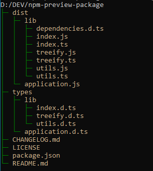

# npm-preview-package

The "**npm-previewpkg**" CLI application generates an overview of the files and directories, which would be part of an npm package when published:
a **package content preview**.

To be more precise, the utility displays the result provided by `npm-packlist` in a user friendly way.

## features

The CLI application implements the following:

- [x] preview as "tree" (default)
- [x] preview as "list"
- [x] sorted output ("file explorer" like)
- [x] colored output
- [ ] stats on files size
- [ ] verbose (preview date, header generated out of the package.json content etc.) ???
- [ ] TBD: template output (%previewdate%, %title%, %filelist% etc.) ???

Example output (showing usage of custom colors):


## requirements

- **node.js** (circa version >= 8.x)  is required to run the application.
- **npm** (circa version >= 6.x) is used to install the application.
- alternatives to npm (untested): **yarn** etc.

## installation

Either **globally** (accessible from everywhere in the shell):

```shell
> npm install -g @khatastroffik/npm-preview-package
```

or **locally** (as a "development dependency"):

```shell
> npm install --save-dev @khatastroffik/npm-preview-package
```

## usage

You may call the application according to the following schema:

- if installed globally

  ```shell
  > npm-previewpkg [options] [path-to-the-package]
  ```

- if installed locally

  ```shell
  > npx npm-previewpkg [options] [path-to-the-package]
  ```

### options and parameter

| argument | type | description |
|---|---|---|
`-l`, `--list`| option | return a flat list instead of a treeview
`-v`, `--version`| option | output the version of this application
`-h`, `--help` | option | display the help message describing the CLI usage
`-d, --dark-colors` | option | use dark colors (preset) for displaying the treeview
`-b, --bright-colors` | option | use bright colors (preset) for displaying the treeview
`-c, --custom-colors` | option | use custom colors for displaying the treeview
`-tc, --text-color <color>` | option | define the custom color of the text. See "extended help"
`-bc, --branch-color <color>` | option | define the custom color of the tree branches. See "extended help"
`-eh, --extended-help` | option | display extended help on "custom colors" and "Usage Examples"
`[path-to-the-package]` | parameter | the path for which a content preview should be displayed.

All arguments are optional i.e. may be omitted. If the path parameter is not specified, then the current directory will be scanned instead i.e. the path default to `./`.

### Custom colors

All custom colors must match a standard CSS color name as defined by the W3C: [W3C color names](https://www.w3.org/wiki/CSS/Properties/color/keywords)

The custom colors may be (pre-) defined as `ENV` (environment) variables like so (e.g.):

```shell
> set TreeifierTextColor=orange
> set TreeifierBranchColor=red
```

Hence, the allowed environment variables are:

- `TreeifierTextColor` for a custom text color
- `TreeifierBranchColor` for a custom color of the tree branches

In case any ENV variable is set prior to calling the application, then the option `--custom-colors` may be used without requiring that the text and/or branch colors are explicitly set in the call.

If the custom colors are not explicitly set in the call, then they default to their corresponding ENV values (if defined) or to the default color "*lightgray*".

### Example calls:

- scan the current directory i.e. `./` (default)
`$ npm-previewpkg`

- scan a specific directory (absolute or relative paths are permitted)
`$ npm-previewpkg ../some-other-app-directory`

- scan the current directory and display the result as an ordered list
`$ npm-previewpkg --list`

- display the preview using dark color mode
`$ npm-previewpkg --dark`

- display the preview using custom colors
`$ npm-previewpkg --text-color orange --branch-color red`

- display the preview using custom colors as defined per ENV variables (see above)
`$ npm-previewpkg --custom-colors`

## CI/CD

This tool could be used to *document a package publication* e.g. as part of a CI/CD workflow.

The CLI would not break the workflow, since it's only generating some text output in the command line (console). The output may be reused/redirected, though.

Example:

  ```shell
  > npm-previewpkg --list > pre-publish-package-content.txt
  ```

## license and repositories

- **License**: MIT - Copyright (c) 2020 Loïs Bégué

- **Code Repository**: The source code of this utility can be found in the following repository: [GitHub :: npm-preview-package](https://github.com/khatastroffik/npm-preview-package)

- **Package Repository**: The installable package containing the utility and the library is available at: [NPM :: npm-preview-package](https://www.npmjs.com/package/@khatastroffik/npm-preview-package)

Note: To conform to the *SoC principle* (Separation of Concerns), the Github repository does not contain the build artifacts and the NPM repository does not contain the sources.
